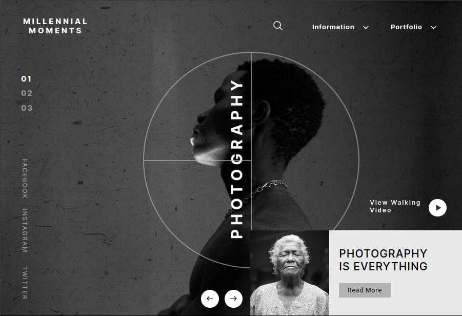

# Millennial-Moments

Développement : <ins>Dyeuse</ins> 
Maquette : <ins>Heta Patel</ins>

[===> Afficher la version en ligne <===](https://millennial-moments.netlify.app/)

## Description

Ce projet est un démonstrateur de compétences.

Il s'agit de l'intégration d'une maquette proposée par un designer via figma. Seule une version 1502px/1024px était fournie.

[Source](https://ui4free.com/website-templates/photography-figma-landing-page.htm)

### Ce projet met en œuvre:

-   Sass/SCSS

-   Design réactif (ex.: medias queries)

-   Animations & transformations

-   Patron de base de code 7-1

-   Gitflow

### Pas de nombres magiques :

Les valeurs concernant les différentes dimensions peuvent sembler arbitraires voire déroutantes. Cependant, elles se basent toutes sur les indications du designer. Pour concilier fidélité du rendu et design adaptatif, il a été nécessaire de recourir à certains calculs et conversions (ex: px => vw).
