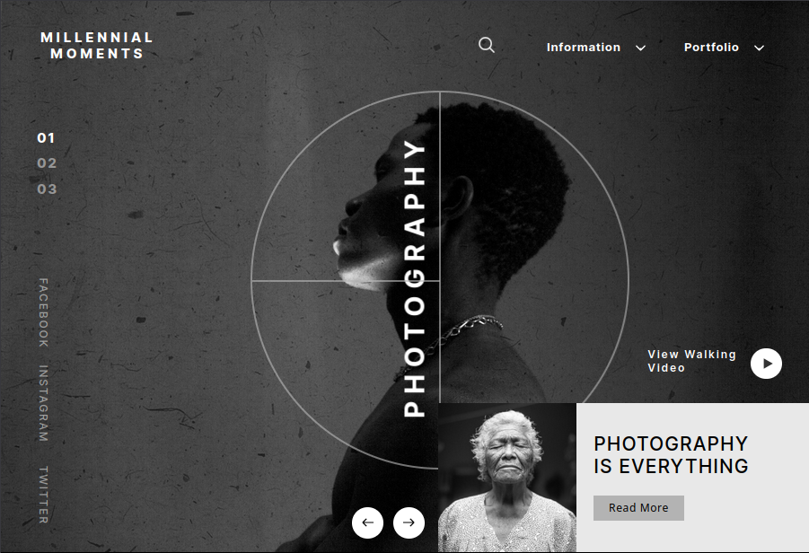

# Millennial-Moments

Development : <ins>Dyeuse</ins> 
Template : <ins>Heta Patel</ins>

[===> Display the online version <===](millennial-moments.netlify.app)

## Description

This is a skills demonstrating project.

It is the integration of a designer’s template obtained via figma. Only a 1502px/1024px version was available.

[Source](https://ui4free.com/website-templates/photography-figma-landing-page.htm)

### This project implements:

-   Sass/SCSS

-   Responsive design (e.g.: medias queries)

-   Animations & transformations

-   Base code pattern 7-1

-   Gitflow

### No magic numbers :

The values of the different dimensions may seem arbitrary even disconcerning. However, the values are solely based on the designer’s instructions. In an effort to combine adaptative design and fidelity to the designer’s template, it was necessary to use some calculations and conversions (e.g.: px => vw).
